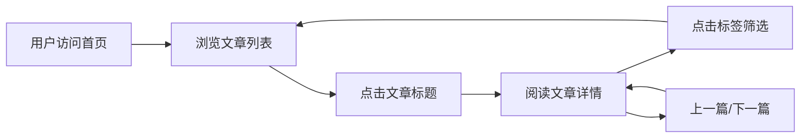

# 产品需求文档 (PRD)

## 1. 产品概述

一个极简的静态文章发布网站，无需数据库，所有文章以 Markdown 文件形式本地存放。构建时自动读取文章并生成静态页面，更新文章后重新构建部署即可。

- 目标用户：个人博主、技术写作者
- 核心价值：零后端依赖，极简维护，专注阅读体验

## 2. 核心功能

### 2.1 功能模块

1. **首页**：展示文章列表，包含标题、摘要、发布日期、标签
2. **文章详情页**：渲染 Markdown 文章内容，支持代码高亮
3. **标签筛选**：点击标签可筛选相关文章

### 2.2 页面详情

| 页面名称 | 模块名称 | 功能描述 |
|---------|---------|---------|
| 首页 | 文章列表 | 按时间倒序展示所有文章，带分页或无限滚动 |
| 首页 | 标签云 | 展示所有标签，点击可筛选文章 |
| 文章详情页 | 文章头部 | 标题、发布日期、标签、阅读时长估计 |
| 文章详情页 | 文章内容 | Markdown 渲染，代码高亮，锚点导航 |
| 文章详情页 | 上一篇/下一篇 | 文章底部导航 |

## 3. 核心流程

用户访问首页 → 浏览文章列表 → 点击文章进入详情页 → 阅读内容 → 点击返回或相关文章继续阅读

## 4. 用户界面设计

### 4.1 设计风格

- **主题**：深色模式为主，护眼且专注阅读
- **主色调**：深灰背景 `#0f0f0f`，文字 `#e5e5e5`，强调色 `#f59e0b`（琥珀金）
- **字体**：标题使用 "Playfair Display"（衬线体，优雅），正文使用 "Source Sans 3"（无衬线，清晰易读）
- **布局**：居中窄栏布局，最大宽度 720px，大量留白
- **代码块**：深色背景，使用 Fira Code 字体

### 4.2 页面设计概述

| 页面名称 | 模块名称 | UI 元素 |
|---------|---------|---------|
| 首页 | 顶部导航 | 网站标题（左侧）、标签筛选（右侧），固定顶部 |
| 首页 | 文章列表 | 每篇文章展示标题（大号衬线体）、日期、摘要、标签 |
| 首页 | 空状态 | 无文章时展示提示 |
| 文章详情页 | 文章头部 | 标题、日期、标签、阅读时长 |
| 文章详情页 | 文章内容 | Markdown 渲染，标题层级清晰，代码高亮 |
| 文章详情页 | 底部导航 | 上一篇/下一篇链接 |

### 4.3 响应式设计

- 桌面端：居中窄栏，最大宽度 720px
- 移动端：全宽布局，减小字体和间距
- 平板：适中宽度，保持阅读舒适度

### 4.4 动效设计

- 页面加载：文章列表渐入动画，stagger 效果
- 悬停：文章卡片轻微上浮，标题颜色变化
- 页面切换：淡入淡出过渡
