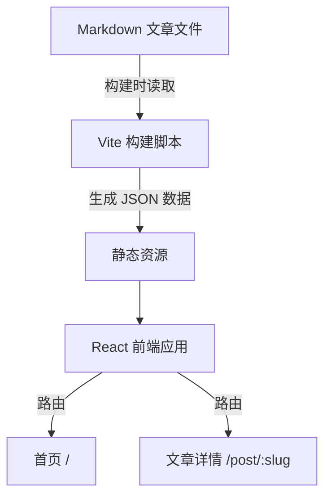

# 技术架构文档

## 1. 架构设计

纯静态网站，构建时读取 Markdown 文件生成数据，前端渲染。



## 2. 技术选型

- **前端框架**：React 18 + TypeScript
- **构建工具**：Vite
- **样式**：Tailwind CSS
- **Markdown 渲染**：react-markdown + remark-gfm
- **代码高亮**：highlight.js
- **路由**：react-router-dom
- **状态管理**：Zustand（轻量，用于标签筛选状态）
- **图标**：lucide-react

## 3. 路由定义

| 路由 | 用途 |
|-----|------|
| `/` | 首页，文章列表 |
| `/post/:slug` | 文章详情页 |

## 4. 数据模型

### 4.1 文章数据结构

文章以 Markdown 文件存放于 `articles/` 目录，文件名格式：`YYYY-MM-DD-slug.md`

Frontmatter 格式：
```yaml
---
title: 文章标题
date: 2024-01-15
tags: [标签1, 标签2]
summary: 文章摘要
---
```

### 4.2 TypeScript 类型定义

```typescript
interface Article {
  slug: string;
  title: string;
  date: string;
  tags: string[];
  summary: string;
  content: string; // Markdown 内容
}
```

## 5. 构建流程

1. 构建时扫描 `articles/` 目录
2. 解析每篇文章的 frontmatter 和内容
3. 生成 `articles.json` 供前端使用
4. Vite 打包生成静态文件到 `dist/`

## 6. 部署方式

- 构建输出 `dist/` 目录为纯静态文件
- 可部署到任何静态托管服务（Vercel, Netlify, GitHub Pages, Nginx 等）
- 更新文章：添加/修改 Markdown 文件 → 重新构建 → 重新部署
